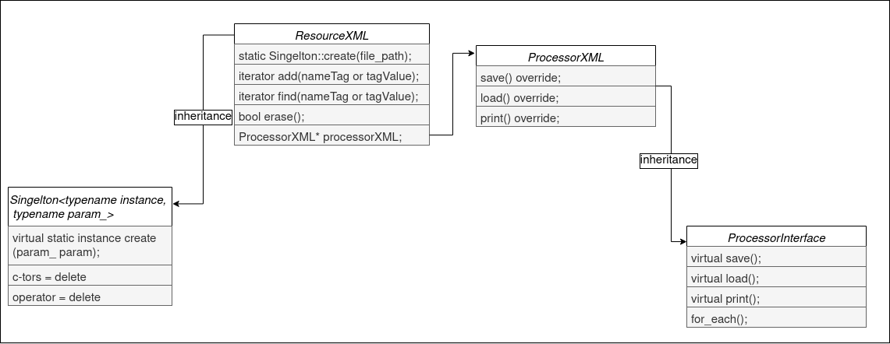

## Resource XML 
______
_aka the second lab for Cpp_

### Tasks:
* Realize `class ResourceXML`, that include following **methods**:
  * override fabric method `create(filePath)` from class Singleton  
  * add the tag `add(nameTag or valueTag) -> iterator`, the method provides **Exception Guarantee**
  * find the tag `find(nameTag or valueTag) -> iterator` 
  * delete the tag `erase(); -> bool`
* Also class include following fields:
  * `ProcessorXML* processorXML` provide **Dependency Inversion**, and following methods:
    * `save()`
    * `print()`
    * `load()`
    * `for_each()`

* iterator may be type of `ResourceXML`

